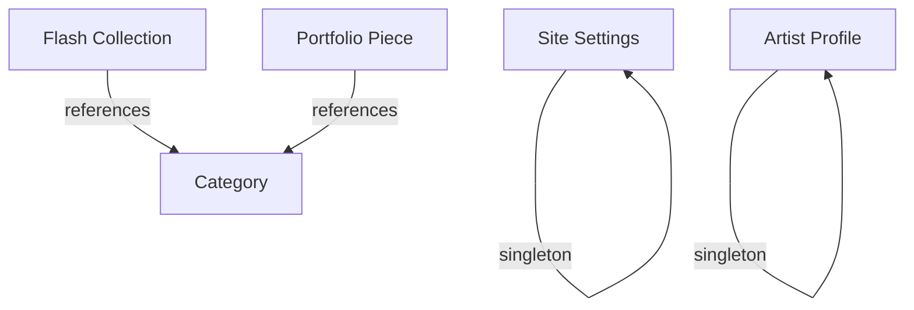

# Sanity Schema Documentation

## Overview

This document describes all content schemas used in the Spíu Gallery CMS. These schemas define the structure and validation rules for content managed through Sanity Studio.

## Table of Contents

- [Flash Collection](#flash-collection)
- [Portfolio Piece](#portfolio-piece)
- [Category](#category)
- [Artist Profile](#artist-profile)
- [Site Settings](#site-settings)

---

## Flash Collection

**Schema Name:** `flashCollection`  
**Purpose:** Represents a collection of tattoo flash designs available for booking

### Fields

| Field              | Type               | Required | Description                                         |
| ------------------ | ------------------ | -------- | --------------------------------------------------- |
| `title`            | `string`           | ✅       | Collection name displayed to users                  |
| `slug`             | `slug`             | ✅       | URL-friendly identifier (auto-generated from title) |
| `coverImage`       | `image`            | ✅       | Main flash sheet image with all designs             |
| `categories`       | `array[reference]` | ✅       | Related tattoo style categories                     |
| `description`      | `text`             | ❌       | Optional collection description                     |
| `designParameters` | `object`           | ❌       | Sizing, placement, and pricing info                 |
| `depositAmount`    | `number`           | ✅       | Required deposit in USD (1-100000)                  |
| `isAvailable`      | `boolean`          | ❌       | Booking availability (default: true)                |
| `bookingNote`      | `text`             | ❌       | Special instructions for bookings                   |

---

## Portfolio Piece

**Schema Name:** `portfolioPiece`  
**Purpose:** Individual tattoo photos showcasing completed work

### Fields

| Field         | Type               | Required | Description                          |
| ------------- | ------------------ | -------- | ------------------------------------ |
| `title`       | `string`           | ✅       | Descriptive name for the piece       |
| `slug`        | `slug`             | ✅       | URL identifier with uniqueness check |
| `image`       | `image`            | ✅       | High-quality tattoo photograph       |
| `categories`  | `array[reference]` | ✅       | Style categories (min 1)             |
| `description` | `text`             | ❌       | Optional piece description           |
| `publishedAt` | `datetime`         | ❌       | Display date (auto-set to now)       |
| `isFeatured`  | `boolean`          | ❌       | Homepage highlight flag              |

---

## Category

**Schema Name:** `category`  
**Purpose:** Tattoo style categories for organizing content

### Fields

| Field         | Type     | Required | Description                   |
| ------------- | -------- | -------- | ----------------------------- |
| `title`       | `string` | ✅       | Category name (min 2 chars)   |
| `slug`        | `slug`   | ✅       | URL-friendly identifier       |
| `description` | `text`   | ❌       | Optional category description |

---

## Artist Profile

**Schema Name:** `artistProfile`  
**Purpose:** Artist information and biography (singleton)

### Fields

| Field          | Type            | Required | Description                      |
| -------------- | --------------- | -------- | -------------------------------- |
| `name`         | `string`        | ✅       | Artist's full name (min 2 chars) |
| `profileImage` | `image`         | ✅       | Professional headshot            |
| `bio`          | `text`          | ✅       | Artist biography (min 50 chars)  |
| `specialties`  | `array[string]` | ✅       | List of tattoo specialties       |

### Studio Preview

Shows artist name and profile image.

---

## Site Settings

**Schema Name:** `siteSettings`  
**Purpose:** Global site configuration (singleton)

### Field Groups

- **General:** Basic site information
- **Contact:** Contact details and social links
- **Booking Policies:** Terms and conditions
- **SEO:** Meta tags and social sharing

### Fields

#### General Group

| Field             | Type     | Required | Description                             |
| ----------------- | -------- | -------- | --------------------------------------- |
| `siteTitle`       | `string` | ✅       | Site name (min 3 chars)                 |
| `siteDescription` | `text`   | ✅       | Site description for SEO (min 20 chars) |

### Studio Preview

Shows site title only.

## Schema Relationships

### Reference Relationships

### Relationship Details

- **Flash Collection → Category:** Many-to-many (one collection can have multiple categories)
- **Portfolio Piece → Category:** Many-to-many (one piece can have multiple categories)
- **Site Settings:** Singleton (only one document)
- **Artist Profile:** Singleton (only one document)

---

## Validation Rules Summary

### Required Fields

- **Flash Collection:** title, slug, coverImage, categories, depositAmount
- **Portfolio Piece:** title, slug, image, categories
- **Category:** title, slug
- **Artist Profile:** name, profileImage, bio, specialties
- **Site Settings:** siteTitle, siteDescription, contact.email, policies, SEO fields
